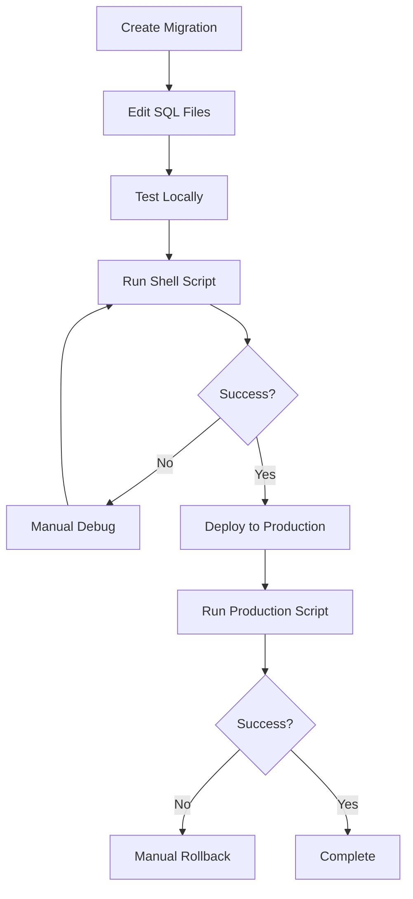
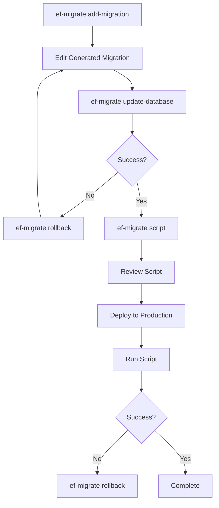

# Migration Systems Comparison: Manual vs Entity Framework Core-like

This document provides a comprehensive comparison between the GRA Framework's manual migration system and the new Entity Framework Core-like migration system.

## 📊 Feature Comparison

| Feature | Manual Migrations | EF Core-like Migrations | Winner |
|---------|------------------|------------------------|--------|
| **Setup Complexity** | 🔴 Complex shell scripts | 🟢 Single CLI tool | EF Core-like |
| **Learning Curve** | 🟡 Medium (shell + SQL) | 🟢 Easy (familiar to .NET devs) | EF Core-like |
| **Version Control** | 🟢 Simple numbered files | 🟢 Timestamped migrations | Tie |
| **Rollback Support** | 🟡 Manual DOWN scripts | 🟢 Automatic rollback | EF Core-like |
| **State Tracking** | 🟡 Basic version table | 🟢 Rich history tracking | EF Core-like |
| **Transaction Safety** | 🟢 Full transaction support | 🟢 Full transaction support | Tie |
| **Team Collaboration** | 🔴 Merge conflicts common | 🟢 Timestamp-based ordering | EF Core-like |
| **Production Deployment** | 🟡 Manual script generation | 🟢 Automated script generation | EF Core-like |
| **Error Recovery** | 🔴 Manual intervention | 🟢 Automatic retry/rollback | EF Core-like |
| **Database Support** | 🟢 PostgreSQL focused | 🟡 PostgreSQL (extensible) | Tie |
| **Auto-generation** | 🔴 None | 🟢 From Go structs | EF Core-like |
| **IDE Integration** | 🔴 None | 🟡 VS Code compatible | EF Core-like |

## 🔄 Migration Lifecycle Comparison

### Manual Migration Workflow



### EF Core-like Migration Workflow



## 📁 Project Structure Comparison

### Manual Migration Structure
```
examples/manual_migrations/
├── README.md
├── db_migrate_v2.sh           # CLI script
├── migrations/
│   ├── 001_initial.sql
│   ├── 002_add_users.sql
│   └── 003_add_profiles.sql
└── tools/migration/direct/
    └── direct_runner.go       # Migration runner
```

### EF Core-like Structure
```
orm/migrations/
├── ef_migration_system.go     # Core migration system
├── migration_runner.go        # Original runner
└── examples/
    └── ef_migrations/
        └── main.go            # Usage examples

tools/ef-migrate/
└── main.go                    # CLI tool

docs/
└── EF_MIGRATION_LIFECYCLE.md # Documentation
```

## 🛠️ Command Comparison

### Manual Migration Commands

```bash
# Check status
./db_migrate_v2.sh test

# Show current version
./db_migrate_v2.sh status  

# Apply migrations
./db_migrate_v2.sh up

# Rollback one version
./db_migrate_v2.sh down

# Apply specific version
./db_migrate_v2.sh up 5
```

### EF Core-like Commands

```bash
# Check status
ef-migrate status

# List all migrations
ef-migrate get-migration

# Create new migration
ef-migrate add-migration CreateUsersTable

# Apply all pending
ef-migrate update-database

# Apply to specific migration
ef-migrate update-database CreateUsersTable

# Rollback to specific migration
ef-migrate rollback InitialCreate

# Generate SQL script
ef-migrate script
```

## 📝 Migration File Comparison

### Manual Migration File (002_add_users.sql)
```sql
-- Manual migration format
-- Version: 002
-- Description: Add users table

BEGIN;

-- Forward migration
CREATE TABLE users (
    id SERIAL PRIMARY KEY,
    email VARCHAR(255) UNIQUE NOT NULL,
    created_at TIMESTAMP DEFAULT CURRENT_TIMESTAMP
);

-- Migration tracking
INSERT INTO schema_migrations (version) VALUES (2);

COMMIT;
```

### EF Core-like Migration File
```sql
-- Migration: CreateUsersTable
-- Description: Add users table with authentication
-- Created: 2023-12-21 10:30:45
-- Version: 1703123456

-- UP Migration
CREATE TABLE users (
    id SERIAL PRIMARY KEY,
    email VARCHAR(255) UNIQUE NOT NULL,
    password_hash VARCHAR(255) NOT NULL,
    created_at TIMESTAMP DEFAULT CURRENT_TIMESTAMP
);

CREATE INDEX idx_users_email ON users(email);

-- DOWN Migration (for rollback)
DROP INDEX IF EXISTS idx_users_email;
DROP TABLE IF EXISTS users;
```

## 🏗️ Database Schema Comparison

### Manual Migration Schema
```sql
-- Simple version tracking
CREATE TABLE schema_migrations (
    version INTEGER PRIMARY KEY,
    applied_at TIMESTAMP DEFAULT CURRENT_TIMESTAMP
);
```

### EF Core-like Schema
```sql
-- EF Core compatible
CREATE TABLE __ef_migrations_history (
    migration_id VARCHAR(150) NOT NULL PRIMARY KEY,
    product_version VARCHAR(32) NOT NULL
);

-- Rich tracking
CREATE TABLE __migration_history (
    id SERIAL PRIMARY KEY,
    migration_id VARCHAR(150) NOT NULL,
    name VARCHAR(255) NOT NULL,
    version BIGINT NOT NULL,
    description TEXT,
    up_sql TEXT NOT NULL,
    down_sql TEXT NOT NULL,
    applied_at TIMESTAMP,
    rolled_back_at TIMESTAMP,
    execution_time_ms INTEGER,
    state VARCHAR(20) DEFAULT 'pending',
    error_message TEXT,
    checksum VARCHAR(64)
);

-- Model versioning
CREATE TABLE __model_snapshot (
    id SERIAL PRIMARY KEY,
    version BIGINT NOT NULL,
    model_hash VARCHAR(64) NOT NULL,
    snapshot_data JSONB NOT NULL,
    created_at TIMESTAMP DEFAULT CURRENT_TIMESTAMP
);
```

## 🚀 Performance Comparison

### Manual Migrations
- **Startup Time**: Fast (simple shell script)
- **Execution Time**: Fast (direct SQL execution)
- **Memory Usage**: Low (shell script + PostgreSQL driver)
- **Disk Usage**: Minimal (simple SQL files)

### EF Core-like Migrations
- **Startup Time**: Medium (Go binary + database connection)
- **Execution Time**: Medium (transaction overhead + logging)
- **Memory Usage**: Medium (Go runtime + rich object models)
- **Disk Usage**: Higher (detailed history + metadata)

## 🔒 Security Comparison

### Manual Migrations
- ✅ **SQL Injection**: Protected (no dynamic SQL)
- ⚠️ **Access Control**: Shell script permissions
- ✅ **Transaction Safety**: Full support
- ❌ **Audit Trail**: Basic version tracking
- ⚠️ **Rollback Safety**: Manual verification required

### EF Core-like Migrations
- ✅ **SQL Injection**: Protected (parameterized queries)
- ✅ **Access Control**: Database-level permissions
- ✅ **Transaction Safety**: Full atomic support
- ✅ **Audit Trail**: Complete history with checksums
- ✅ **Rollback Safety**: Automatic validation

## 👥 Team Collaboration

### Manual Migration Challenges
```bash
# Developer A creates migration
echo "003_add_users.sql" > migrations/003_add_users.sql

# Developer B creates migration (same day)
echo "003_add_profiles.sql" > migrations/003_add_profiles.sql

# CONFLICT: Both have version 003!
# Manual resolution required
```

### EF Core-like Solution
```bash
# Developer A creates migration
ef-migrate add-migration CreateUsers
# Creates: 1703123456_CreateUsers

# Developer B creates migration (same day)  
ef-migrate add-migration CreateProfiles
# Creates: 1703123457_CreateProfiles

# NO CONFLICT: Timestamps ensure unique ordering
```

## 🌍 Production Deployment

### Manual Migration Deployment
```bash
# 1. Generate scripts manually
cat migrations/001_*.sql > production_script.sql
cat migrations/002_*.sql >> production_script.sql

# 2. Review manually
vim production_script.sql

# 3. Apply manually
psql -f production_script.sql

# 4. Verify manually  
psql -c "SELECT version FROM schema_migrations;"
```

### EF Core-like Deployment
```bash
# 1. Generate script automatically
ef-migrate script > production_script.sql

# 2. Review generated script
cat production_script.sql

# 3. Apply in production
psql -f production_script.sql

# 4. Verify automatically
ef-migrate status
```

## 📈 Scalability Comparison

| Aspect | Manual | EF Core-like | Notes |
|--------|--------|-------------|-------|
| **Large Teams** | 🔴 Poor | 🟢 Excellent | Timestamp-based ordering |
| **Many Migrations** | 🟡 OK | 🟢 Excellent | Rich metadata & search |
| **Complex Rollbacks** | 🔴 Difficult | 🟢 Easy | Automatic dependency resolution |
| **Multi-Environment** | 🟡 Manual sync | 🟢 Automatic sync | State tracking across environments |
| **CI/CD Integration** | 🟡 Custom scripts | 🟢 Standard tools | CLI tool integration |

## 🎯 Use Case Recommendations

### Use Manual Migrations When:
- 🔧 **Simple Projects**: Small, single-developer projects
- 🏃 **Quick Prototypes**: Rapid development with minimal overhead
- 🎓 **Learning**: Understanding migration concepts from scratch
- 🛠️ **Custom Requirements**: Highly specialized migration logic
- 💰 **Resource Constrained**: Minimal memory/disk usage requirements

### Use EF Core-like Migrations When:
- 👥 **Team Development**: Multiple developers working together
- 🏢 **Production Systems**: Enterprise applications with complex deployments
- 🔄 **Frequent Changes**: Rapid iteration with many schema changes
- 🛡️ **Safety Critical**: Applications requiring robust rollback capabilities
- 📊 **Audit Requirements**: Need detailed migration history and compliance
- 🚀 **CI/CD Integration**: Automated deployment pipelines
- 💼 **Enterprise Integration**: Teams familiar with Entity Framework Core

## 🔮 Migration Path

### From Manual to EF Core-like

If you're currently using manual migrations and want to upgrade:

#### Step 1: Export Current State
```bash
# Export current schema
pg_dump --schema-only mydb > current_schema.sql

# Export migration history
psql -c "SELECT version FROM schema_migrations ORDER BY version;" > migration_history.txt
```

#### Step 2: Initialize EF System
```bash
# Initialize EF migration system
ef-migrate status

# Create baseline migration
ef-migrate add-migration Baseline "Import from manual migration system"
```

#### Step 3: Import Current State
```sql
-- Edit the Baseline migration to match current schema
-- UP Migration: (empty - schema already exists)
-- 

-- DOWN Migration: Drop everything
DROP TABLE IF EXISTS users, profiles, settings;
```

#### Step 4: Mark as Applied
```bash
# Mark baseline as applied without executing
psql -c "INSERT INTO __ef_migrations_history (migration_id, product_version) VALUES ('Baseline', 'GRA-1.0.0');"
```

#### Step 5: Continue with EF Migrations
```bash
# All new migrations use EF system
ef-migrate add-migration AddNewFeature
ef-migrate update-database
```

## 📋 Summary

| Criteria | Manual Migrations | EF Core-like Migrations | Winner |
|----------|------------------|------------------------|--------|
| **Simplicity** | 🟢 Simple for small projects | 🟡 More complex setup | Manual |
| **Scalability** | 🔴 Poor for teams | 🟢 Excellent for teams | EF Core-like |
| **Safety** | 🟡 Manual verification | 🟢 Automatic validation | EF Core-like |
| **Productivity** | 🔴 Manual processes | 🟢 Automated workflows | EF Core-like |
| **Learning Curve** | 🟡 Shell scripting knowledge | 🟢 Familiar to .NET developers | EF Core-like |
| **Maintenance** | 🔴 High manual effort | 🟢 Low maintenance | EF Core-like |

## 🏆 Overall Winner: EF Core-like Migrations

For most production applications and team environments, the **EF Core-like migration system** provides significant advantages in terms of safety, productivity, and collaboration. The manual system remains valuable for simple projects or learning purposes.

The EF Core-like system offers:
- ✅ **Better Developer Experience**: Familiar commands and workflows
- ✅ **Enhanced Safety**: Automatic rollback and validation
- ✅ **Team Collaboration**: Conflict-free migration ordering
- ✅ **Production Ready**: Robust deployment and monitoring tools
- ✅ **Future Proof**: Extensible architecture for advanced features

Choose the EF Core-like system for new projects and consider migrating existing manual systems for better long-term maintainability.
